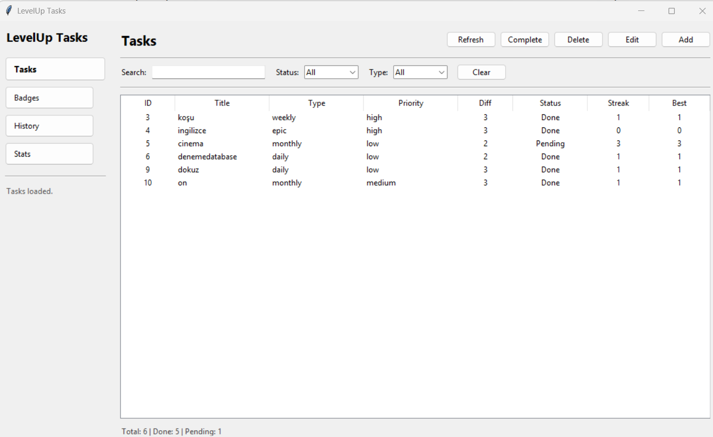
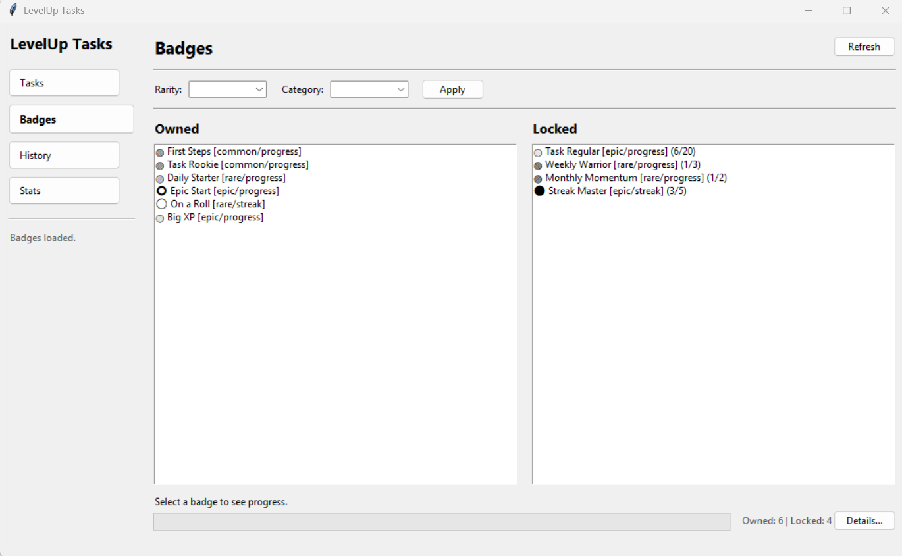
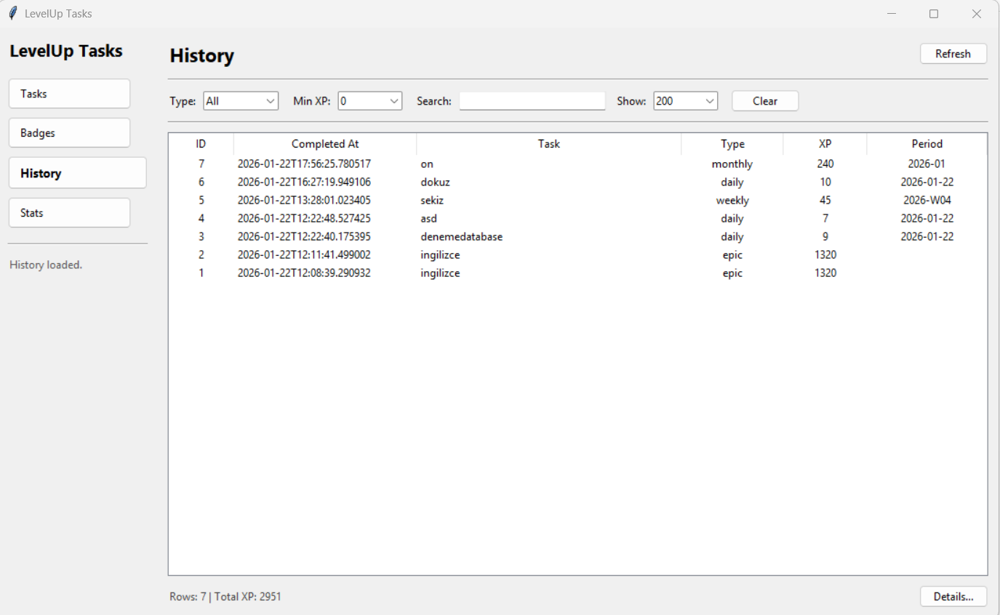
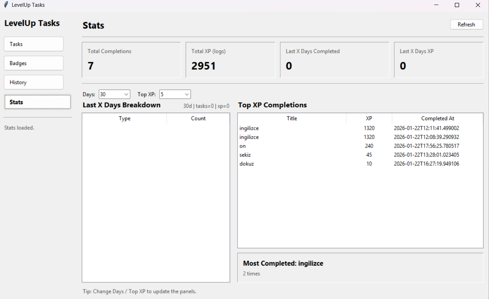

# LevelUp Tasks 🎯

LevelUp Tasks is a gamified task and habit tracking application built with Python.

The project turns regular task management into a simple progression system with XP, levels, streaks, badges, completion history, and statistics.

It was designed as a personal productivity tool and also as a portfolio project to demonstrate clean Python architecture, SQLite persistence, GUI development, and gamification logic.

---

## Screenshots

| Tasks | Badges |
|-------|--------|
|  |  |

| History | Stats |
|---------|-------|
|  |  |

---

## Features

### Task Management
- Add, edit, delete, and complete tasks
- Task types: Daily, Weekly, Monthly, Epic
- Priority and difficulty levels
- Status tracking: pending / completed
- Period-based completion rules

### Gamification System
- XP gain after completing tasks
- Level progression
- Streak and best streak tracking
- Different behavior for recurring and epic tasks
- Badge reward system

### Badge System
- Badge definitions managed through `badges_config.json`
- Earned badges stored in SQLite
- Badge progress tracking
- Badge details screen
- Duplicate badge prevention with database-level unique constraint

### History System
- Every completed task saved into `task_log`
- Completion date, task type, priority, difficulty, gained XP, and period stored
- Filterable history screen
- Task completion timeline

### Statistics Dashboard
- Total completed tasks
- Total gained XP
- Last N days summary
- XP breakdown by task type
- Top XP tasks
- Most completed task

### GUI
- Built with Tkinter
- Sidebar navigation
- Separate screens for Tasks, Badges, History, and Stats
- F5 / Ctrl+R refresh support
- Service-first GUI architecture

---

## Tech Stack

- Python
- Tkinter
- SQLite
- Object-Oriented Programming
- Repository Pattern
- Service Layer Architecture
- JSON configuration
- SQL migrations

---

## Project Structure

```text
LevelUp Tasks/
│
├── database/
│   ├── connection.py
│   ├── init_db.py
│   ├── migrations.py
│   ├── task_repo.py
│   ├── player_repo.py
│   ├── tasklog_repo.py
│   └── badge_repo.py
│
├── gui/
│   ├── app.py
│   ├── main_window.py
│   ├── screens/
│   │   ├── tasks_screen.py
│   │   ├── badges_screen.py
│   │   ├── history_screen.py
│   │   └── stats_screen.py
│   └── dialogs/
│
├── services/
│   └── app_service.py
│
├── docs/
│   └── screenshots/
│
├── badges.py
├── badges_config.json
├── history.py
├── main.py
├── menus.py
├── models.py
├── stats.py
├── time_utils.py
└── README.md
```

---

## Architecture Overview

The project follows a clean layered structure:

```
GUI / CLI
   ↓
AppService
   ↓
Repositories
   ↓
SQLite Database
```

### Main Design Principles

- GUI does not access the database directly
- GUI does not contain business logic
- All major use-cases are handled by `AppService`
- Database operations are isolated inside repository classes
- SQLite is treated as the single source of truth
- Critical operations are handled inside a single transaction

---

## Core Flow: Completing a Task

When a task is completed, the following operations happen in one transaction:

1. Find task
2. Check period-based completion rule
3. Update task status and streak
4. Calculate XP
5. Update player XP and level
6. Insert task completion log
7. Check and award badges
8. Save updated player
9. Commit transaction

This prevents inconsistent states such as:
- XP gained but task not logged
- Badge awarded but player not updated
- Task completed but history not saved

---

## Database

The project uses SQLite.

**Main tables:**

| Table | Purpose |
|-------|---------|
| `tasks` | Task definitions |
| `player` | Player profile, XP, level, streaks |
| `task_log` | Completion history |
| `badge_earned` | Earned badges |
| `schema_version` | Migration tracking |

The database is initialized through migration logic. Indexes and unique constraints are used for better stability and data consistency.

---

## How to Run

1. Open the project folder in terminal:

```bash
cd "C:\Users\Umut Cetin\Desktop\Python Projeler\LevelUp Tasks"
```

2. Activate virtual environment:

```powershell
.\.venv\Scripts\Activate.ps1
```

3. Run the GUI:

```bash
python -m gui.app
```

---

## Portfolio Summary

LevelUp Tasks is a Python-based gamified productivity application that combines task management, XP progression, streak tracking, badges, history logging, and statistics. The project uses SQLite for persistence, a repository pattern for database access, and a service layer to separate business logic from the GUI.

---

## License

This project is for personal learning and portfolio purposes.
